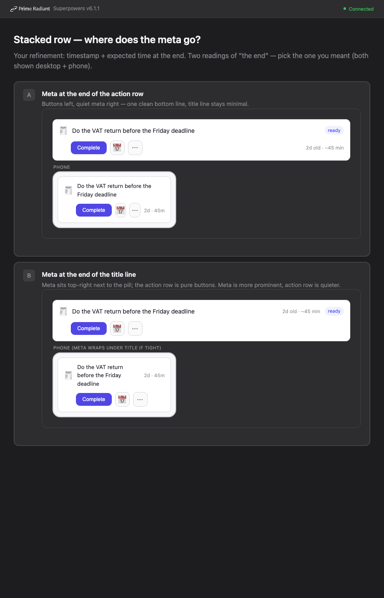

# Task-Row Redesign + Scheduling Entry Points — Design

**Date:** 2026-07-16 · **Owner-approved via mockup session** (screenshots in `assets/`).
Depends on: Integrations panel spec (2026-07-16) for connect/reconnect states. Related: #22.

## Problem

Scheduling only exists inside a task's breakdown view, immediately after saving a breakdown.
Task rows (inbox + bucket board) have accreted six visible controls and still can't schedule.
Rows are visually loud — the opposite of what an ADHD-focused app should feel like.

## Approved design

**Stacked row, used everywhere rows appear (inbox view + bucket board), all breakpoints:**

- **Title line:** emoji · title (full width, wraps) · meta at the end (`2d old · ~45 min`,
  quiet gray) · status pill.
- **Action line:** `[contextual primary] [📅] [⋯]` — big touch targets, left-aligned under
  the text.
  - **Contextual primary** = the task's next right thing: `✂️ Break down` (unclarified) →
    `Complete` (ready). Mirrors existing per-state CTAs; no new state logic invented.
  - **📅 Schedule** is always present in the same slot (muscle memory).
  - **⋯ overflow** holds Move to… / Edit / Delete (reuses the existing move-to menu).

Rejected along the way (see `assets/2026-07-16-row-layout-options.png`): always-inline icon
(row too busy), hover-reveal bar (undiscoverable, weak on touch), single-line inline layout
(title crush + tiny touch targets on phones), responsive hybrid (owner prefers one consistent
arrangement).

## 📅 behavior

| Task state | Tap 📅 → |
|---|---|
| Has steps | Push steps to Google Tasks (existing `pushStepsToGoogleTasks` path) |
| No steps | Quick duration popover — 15 / 30 / 60 min / custom — then create ONE Google Task titled with the `(duration:Xm)` convention |
| Google not configured/connected | Route to Settings → Integrations (connect) |
| `needsReconnect` | "Reconnect Google →" (integrations-panel state) |

Single-task scheduling needs a task-level `googleTaskId`/`googleTaskListId` (steps already
have them) — additive schema change, mirrors the step columns.

## Components

- `src/components/tasks/task-row.tsx` — the shared stacked row (title line + action line),
  consumed by inbox view and bucket board. Overflow menu extracted/reused from the existing
  move-to menu. One component, one test file.
- `SchedulePopover` — duration picker for the no-steps path.
- New server action `scheduleSingleTask(taskId, minutes)` — owner-gated, wraps the Google
  Tasks client; failure union mirrors `pushStepsToGoogleTasks` (incl. `reconnect_required`).

## Error handling

- Popover and pushes surface the same failure reasons the breakdown view uses today
  (`not_configured`, `not_connected`, `reconnect_required`, `error`) with inline text.
- Guests: 📅 hidden (scheduling is owner-only; guests keep current row minus owner actions).

## Testing

- RTL: row renders both states (primary swaps), meta at title end, ⋯ menu contents,
  📅 popover flow, guest variant hides owner actions.
- Action tests: `scheduleSingleTask` happy path + each failure reason.
- a11y: ⋯ and popover keyboard-reachable; buttons ≥ 34px targets.
- Full suite green; runtime verify via local prod build (schedule a single task end-to-end
  against dev DB with Google mocked/disconnected states).

## Out of scope

Board drag-drop changes · breakdown-view schedule panel (stays, wording updated by the
integrations MR) · recurring/scheduled-time pickers (Reclaim owns actual calendaring).
